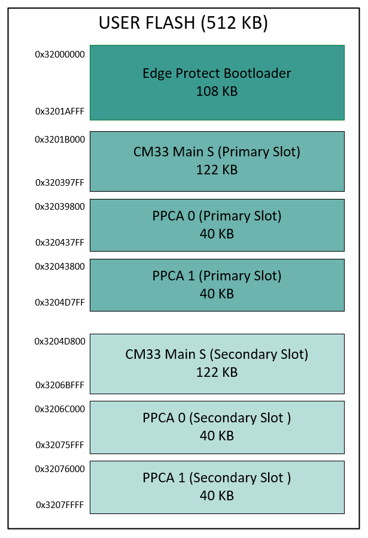
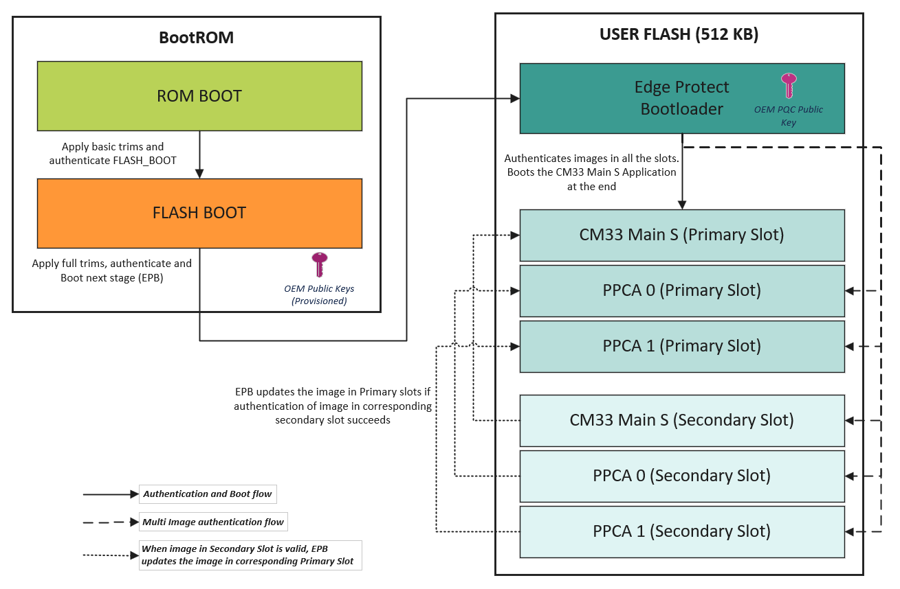
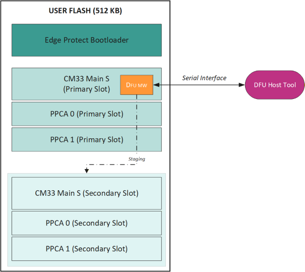

[Click here](../README.md) to view the README.

## Design and implementation

This code example uses a three-project structure to develop code for the main CM33, PPCA0, and PPCA1 cores. Although TrustZone is enabled in main CM33 core, this example uses only the secure processing environment (SPE). The three project folders are:

**Table 1. Application projects**

Project       | Description
-------       | -----------------------
*main_cm33_s* | Project for main CM33 SPE
*ppca_cm33_0* | Project for PPCA CM330 non-secure processing environment (NSPE)
*ppca_cm33_1* | Project for PPCA CM331 NSPE

This code example needs **EdgeProtect Bootloader** project. The EdgeProtect Bootloader (EPB) is a secure bootloader designed for Infineon's PSOC&trade; Control MCU, enabling trusted firmware updates and secure application launches.

 

The main CM33 core acts as the secure orchestrator and applies the required device security. It loads the PPCA core images into their respective CODE SRAM regions and enables the cores. It also hosts the DFU middleware to download update images and stage them in the secondary slots.

After a successful boot, the PPCA cores blink the LEDs.

### Resources and settings

The application uses UART to print messages on the UART terminal. The UART resource initialization and retargeting of the standard I/O to the UART port is performed using the [retarget-io](https://github.com/Infineon/retarget-io) library.
The application uses I2C to receive the update image to perform the secure firmware update. The I2C port is managed by the [DFU](https://github.com/Infineon/dfu) middleware.

**Table 2. Application resources**

Resource    |  Alias/object      |    Purpose
:---------- | :------------------| :------------
 UART (HAL) | DEBUG_UART_hal_obj | UART HAL object for debug UART
 I2C  (HAL) | dfuI2cHalObj       | I2C HAL object used for DFU transport
 GPIO (PDL) | CYBSP_USER_LED4    | User LED 4 from PPCA Core 0
 GPIO (PDL) | CYBSP_USER_LED6    | User LED 6 from PPCA Core 1
 GPIO (PDL) | CYBSP_USER_LED1    | User LED 1 from main core

### Flash Layout

The PSOC&trade; Control C3M8 MCU provides 512 KB of internal flash.
   - one slot for the Edge Protect Bootloader (EPB), starting at `0x32000000` with size `0x1B000` (108KB). A secondary slot is not required because the EPB is not updated in this example.
   - Three primary application image slots, each with a dedicated secondary slot for staging updates.
   - Ensure that the combined size of all primary and secondary slots, metadata, and the EPB fits within 512 KB.
   - Use secondary slots to stage new images safely before copying them to the corresponding primary slots after authentication.

   **Figure 1. Flash mapping**

   

### Firmware Boot and Update Flow

1. The BootROM transfers control to the EdgeProtect Bootloader (EPB). Optionally, when [secure boot of the EPB](setup.md#3-secure-boot-of-the-edgeprotect-bootloader) is enabled, the BootROM first authenticates the signed EPB image (described by `boot_app_layout` in the OEM policy) and transfers control only if authentication succeeds.

2. The EPB loads its configuration and public validation key, then enumerates all image slots (primary and secondary).

3. The EPB authenticates the application image using the configured scheme (ML-DSA-44 or ML-DSA-65 or ML-DSA-87 or LMS_SHA256_M32_H10 or XMSS_SHA2_10_256 or ECDSA-256 or ECDSA-384 or ECDSA-521). Any image that fails authentication is rejected.

4. If the secondary slot contains a valid update image, EPB promotes it by copying the image to the primary slot. When [encrypted update](#encrypted-update-optional) is enabled, the update image staged in the secondary slot is encrypted; EPB decrypts it on the fly during this copy so that the primary slot always holds the plain-text, executable image.

5. After validation (and any required promotion), EPB boots the main CM33s application from the primary slot.

   **Figure 2. Flow Chart**

   

## Encrypted update (optional)

The EdgeProtect bootloader can decrypt firmware while it promotes an update image from the secondary (upgrade) slot to the primary slot. This protects the firmware payload against reverse engineering during transport and staging. Encryption is layered on top of signing — the bootloader authenticates the image first (using the configured signature scheme) and then decrypts it, so image validation must remain enabled. Only `UPDATE` images (`IMG_TYPE=UPDATE`) are encrypted; `BOOT` images are executed in place and always remain in plain text. Encryption is **off by default**.

> **Note:** For the supported encryption methods, signing-scheme compatibility, and step-by-step instructions to enable encryption, see [Encrypted update setup](setup.md#2-encrypted-update).

### Update Image Download/Staging

1. The application integrates Infineon's DFU middleware to receive firmware updates over I2C and stage them into the designated secondary slot.

2. The middleware manages the transfer (session control, chunking, and integrity checks) and writes the signed image and associated metadata to flash.

3. On the PC, use the DFU Host tool to initiate the download and send the signed image over I2C to the device's DFU endpoint.

4. After a successful transfer, the image remains in the secondary slot until EPB validates and promotes it on the next boot.

   **Figure 3. Update Image Download**

   
